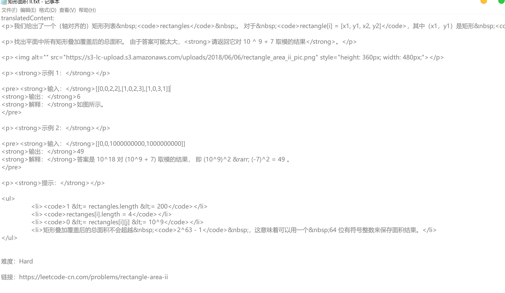

# 你需要修改的地方：

1.  `dir.MakeDir.py`中的path，表示你希望题目存储的地址
2.  （可选）如果你是 会员用户可在`promblem.Problem_Dtail`中的ck里填入你的cookie以爬取**会员专享题**。

## 你需要了解：

* **爬取的题目形式为html，包含html标签方便进行渲染。当然如果你觉得不妥可以自行修改（problem.Problem_detal中）**
* 由于发现leetcode没有反爬，本项目并未使用代理请求。 

### 项目介绍

*  `main.py`项目入口
* `dir.Makedir.py`创建存放对应标签题目的所有文件夹 
* `label.Label_Dic.py`获取力扣题库中所有题目类型标签与对应的英文名（dic）
* `label.Label_List.py`获取所有标签名（List）
* `problem.Problem_Url_Queue`通过传参（标签英文名字）获取对应标签里的所有题目
* `problem.Problem_detal.py`请求获取题目详情并以txt文件形式存储题目

### 爬取结果示例图

